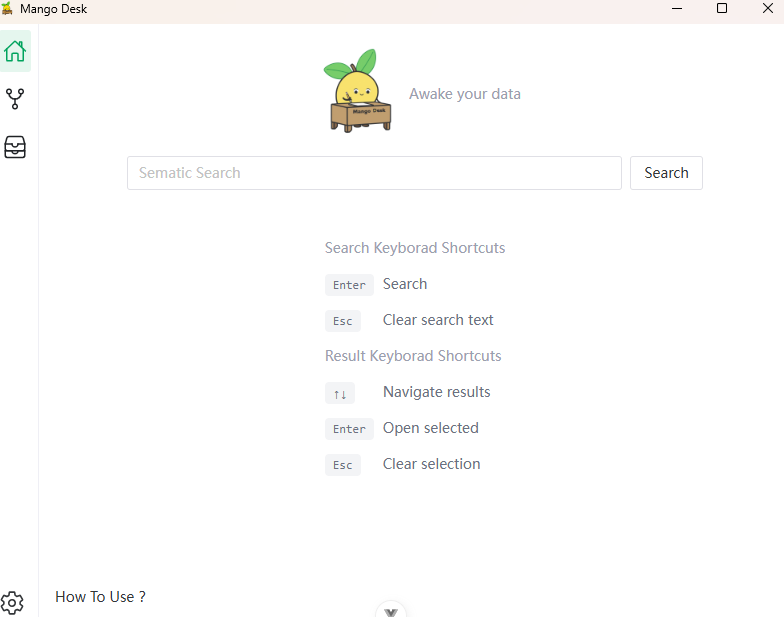

<sup>[English](./README.md) | [中文](./README_CN.md)</sup>

# Mango Desk

**🥭 Awake your data**  


[](https://github.com/moyangzhan/mango-desk/releases)

## What is Mango Desk?

Mango Desk is a local-first desktop app for searching your local documents with natural language.

It helps you find information based on what you remember, not file names or folder structures.

### 📌 Use Cases

Mango Desk is especially useful in scenarios where you have **a large amount of local documents** and want to retrieve information using natural language.


#### Typical Use Cases

- 📝 **Personal Document Libraries**
  - Years of accumulated notes, PDFs, Word files, Markdown files. etc
  - Example: *“That note where I summarized Rust ownership rules”*

- 📂 **SVN / Git Repositories**
  - Search through design docs, READMEs, technical proposals, and historical solutions
  - Example: *“Where is the document about the permission refactor?”*

- 🏢 **Team or Company Knowledge Base**
  - Internal documents, project docs, meeting notes, onboarding materials
  - Example: *"Find all Q4 meeting notes about budget planning"*
  - Example: *"What are the company policies regarding remote work?"*

- 📚 **Research and Study Materials**
  - Papers, experiment records, literature notes
  - Example: *“What is the latest research on AI?”*

- ⚖️ **Legal and Financial Documents**
  - Contracts, policy documents, reports
  - Example: *“What is the latest company policy on data privacy?”*

### ✨ Features

- 🔍 **Search by meaning, not file names**
  - Find documents by describing what you remember, even if you don’t recall exact titles or locations

- 📂 **Works with your existing local files**
  - No need to reorganize folders or rename files — Mango Desk works with what you already have

- ⚡ **Fast and lightweight**
  - Instant search results without slowing down your system

- 🔒 **Private by default**
  - All data stays on your device, ensuring your privacy

### 🛠️ Technology Stack

* Frontend
  * WebView（Tauri）
  * PNPM
  * Node.js
* Backend
  * Rust
  * Tauri Core

## 🚀 Setting Up

### 1. Frontend
#### Node
`node` v20+ required

It is recommended to use [nvm](https://github.com/nvm-sh/nvm) to manage multiple `node` versions.

#### PNPM

`pnpm` v9+ required

If you haven't installed `pnpm`, you can install it with the following command:

```shell
npm install pnpm -g
```

#### Install dependencies

```sh
pnpm i
```

### 2. Backend(Rust)
`rust` v1.90.0+ required

Install tools: [https://www.rust-lang.org/tools/install](https://www.rust-lang.org/tools/install)

### 3. Tauri

Install Tauri Prerequisites: 
[https://tauri.app/start/prerequisites/](https://tauri.app/start/prerequisites/)

## ▶️ Development Run

A Tauri app has at least [two processes](https://tauri.app/concept/process-model/):

- the Core Process (`backend`)
- the WebView process (`frontend`)

Both backend and frontend start with a single command:

```sh
pnpm tauri dev
```

## 📦 Building


```sh
pnpm tauri build
```

After building, the executable file is usually located in `src-tauri/target/release/`.

windows: `src-tauri/target/release/bundle/msi/Mango Desk_0.1.0_x64_en-US.msi`

## 📝 License

see the [LICENSE](LICENSE) file for details.

## 🤝 Contributing

Contributions of all kinds are welcome, including but not limited to:
* 🐛 Reporting bugs
* 💡 Suggesting new features or improvements
* 📖 Improving documentation
* 🔧 Submitting code (pull requests)

Before submitting a pull request, please consider:
1. Fork this repository
2. Create a new branch for your changes
3. Keep commit messages clear and readable
4. Make sure `pnpm tauri dev` runs successfully in your local environment

## ⭐ Support the Project

Support Mango Desk if you find it helpful:
- Starring the repository on GitHub
- Recommending it to others
- Sharing your experience

## 💻 Sceenshots

