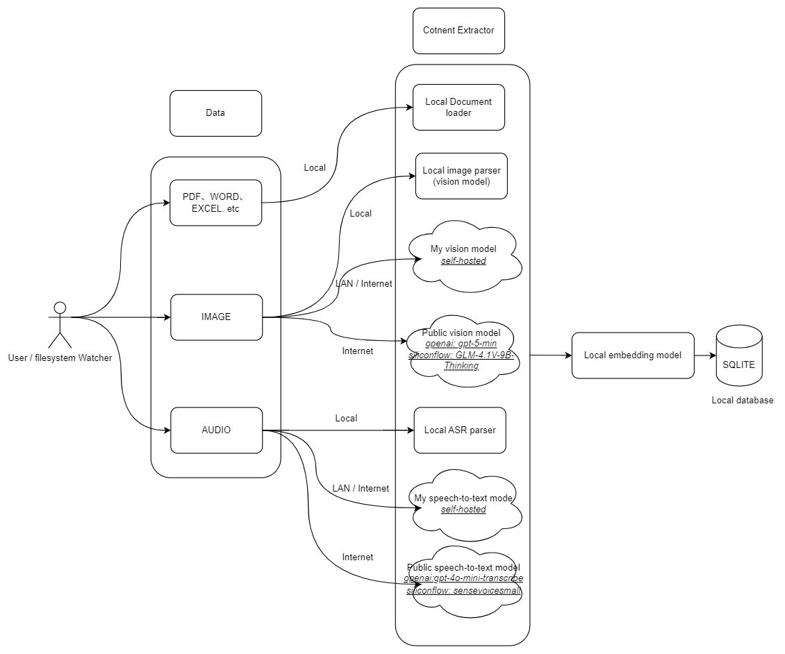

<sup>[English](./README.md) | [中文](./README_CN.md)</sup>

# Mango Finder

**🥭 Awake your data**


[](https://github.com/moyangzhan/mango-finder/releases)

## 📖 项目简介

Mango Finder（原名 MangoDesk）是一款用自然语言搜索本地文件的桌面应用。

帮助您根据记忆中的内容查找信息，而不需要记住文件名或文件夹结构。


### 📌 使用场景

拥有**大量本地文档**并希望通过自然语言检索信息时。

- 📝 **个人文档库**
  - 多年来积累的笔记、PDF、Word 文件、Markdown 文件等
  - 示例：*"总结 Rust 所有权和借用规则的文件"*

- 📂 **SVN / Git 仓库**
  - 搜索设计文档、README、技术方案和历史解决方案
  - 示例：*"去年关于权限系统重构的技术方案和思路"*

- 🏢 **团队或公司知识库**
  - 内部文档、项目文档、会议记录、入职材料
  - 示例：*"第四季度关于预算规划的会议内容及团队反馈"*

- 📚 **研究与学术资料**
  - 论文、实验记录、文献笔记
  - 示例：*"大语言模型在提高推理效率方面的最新突破"*

- ⚖️ **法律与财务文档**
  - 合同、政策文件、报告
  - 示例：*"公司章程中关于数据隐私和用户授权的相关条款"*

### ✨ 特性

- 💭 **按内容意思搜索**
  - 通过描述您记得的意思相近内容来查找文档

- 📍 **关键词精确匹配**
  - 通过文件路径或内容中的精确关键词快速定位。当你记得特定的术语或短语时，这是最理想的选择

- 🔍 **相似文件查找**
  - 支持视觉相似图片查找（感知哈希）、语义相似文档查找、音频内容相似查找
  - 一键发现基于视觉、语义或音频指纹相似的相关文件

- 🌐 **多语言与跨语言搜索**
  - 无缝支持 100 多种语言。支持跨语种检索（例如使用中文搜索英文内容），无需任何额外配置

- 🔒 **默认保护隐私**
  - 所有数据都保留在您的设备上，确保隐私安全

- 🖥️ **自托管模型支持**
  - 集成 **Ollama** 和 **vLLM**，可使用本地视觉模型（如 LLaVA）进行图片分析
  - 在本地硬件上运行模型，保持数据完全私密

- ⚡ **快速高效**
  - 通过优化的索引系统提供即时搜索结果

- 👀 **实时文件和目录监控**
  - 自动检测文件和文件夹的变更（添加/修改/删除），并保持索引及搜索结果的实时更新

- 📂 **兼容现有本地文件**
  - 无需重新整理文件夹或重命名文件 — Mango Finder 直接使用您已有的文件

### 🏗️ 架构

**索引**



支持三种处理模式：**本地模式**（完全离线）、**自托管模式**（Ollama/vLLM）、**云端模式**（远程 AI 服务）。

**搜索**


### 🛠️ 技术栈

* Frontend
  * WebView（Tauri）
  * PNPM
  * Node.js
* Backend
  * Rust
  * Tauri Core

## 🚀 快速开始（开发环境）

### 1. 前端环境准备

#### Node

``node` **v20 及以上版本**

推荐使用 [nvm](https://github.com/nvm-sh/nvm) 来管理多个 `node` 版本。

#### PNPM

需要 `pnpm` **v9 及以上版本**

如果你还没有安装 `pnpm`，可以使用以下命令安装：

```shell
npm install pnpm -g
```

#### 安装依赖

```sh
pnpm i
```

### 2. 后端环境准备（Rust）

需要`rust` v1.92.0 及以上

建议使用官方工具安装：[https://www.rust-lang.org/tools/install](https://www.rust-lang.org/tools/install)

### 3. Tauri

在运行项目前，请先根据你的操作系统安装 Tauri 所需依赖：

[https://tauri.app/start/prerequisites/](https://tauri.app/start/prerequisites/)

### 4. Whisper.cpp 依赖

音频转文字功能使用 [whisper.cpp](https://github.com/ggerganov/whisper.cpp)，不同操作系统需要安装不同的依赖。

#### Windows

在 Windows 上编译需要安装 **CMake** 和 **LLVM/Clang 18**（注意：LLVM 19/20/22 版本存在兼容性问题，请使用 LLVM 18）。

1. **安装 CMake 4.3**

   从 [cmake-4.3.0](https://github.com/Kitware/CMake/releases/tag/v4.3.0-rc2) 下载安装

2. **下载并安装 LLVM 18**
   - 访问 [LLVM 18.1.8 Release](https://github.com/llvm/llvm-project/releases/tag/llvmorg-18.1.8)
   - 下载 `LLVM-18.1.8-win64.exe`
   - 安装时勾选 **"Add LLVM to the system PATH for all users"**

3. **验证安装**
   ```sh
   cmake --version
   clang --version
   ```
   clang 版本应显示 `18.1.8`

4. **设置环境变量（永久）**
   - 按 `Win + R`，输入 `sysdm.cpl`，回车
   - 点击 **"高级"** 选项卡 → **"环境变量"**
   - 在 **"用户变量"** 区域点击 **"新建"**，添加：

   | 变量名 | 值 |
   |--------|-----|
   | `CXXFLAGS` | `/utf-8` |
   | `CFLAGS` | `/utf-8` |

   - 点击确定，**重启终端** 使环境变量生效

5. **编译项目（仅首次需要）**

   打开 **"x64 Native Tools Command Prompt for VS 2022"**（从开始菜单搜索），然后编译：
   ```cmd
   cd your-project-path\src-tauri
   cargo build
   ```

   > ⚠️ **重要提示**：
   > - `/utf-8` 参数是必需的，用于解决中文编码问题
   > - 如果之前编译失败，先运行 `cargo clean -p whisper-rs-sys` 清理缓存
   > - whisper 编译成功后，后续可直接在任意终端使用 `pnpm tauri dev`
   > - VSCode 的 rust-analyzer 插件会在启动时自动检查代码，由于没有 MSVC 环境，whisper-rs-sys 的构建会失败并以红色标识显示在 `target/debug/build` 目录中。如果你已在 "x64 Native Tools Command Prompt for VS 2022" 中构建成功，可以忽略此错误

#### macOS

macOS 通常已内置 Clang，无需额外安装。如果遇到问题，可以安装 Xcode Command Line Tools：

```sh
xcode-select --install
```

#### Linux

大多数 Linux 发行版需要安装 C/C++ 编译工具：

**Ubuntu/Debian:**
```sh
sudo apt update
sudo apt install build-essential cmake
```

**Fedora/RHEL:**
```sh
sudo dnf install gcc-c++ make cmake
```

**Arch Linux:**
```sh
sudo pacman -S base-devel cmake
```

### 5. 下载模型文件

请从以下任一来源下载所需的模型文件：

1. **GitHub Release**: [model.zip](https://github.com/moyangzhan/mango-finder/releases/download/v0.1.0/model.zip) - 包含所有必需文件
2. **Hugging Face**: [moyangzhan/mango-finder](https://huggingface.co/moyangzhan/mango-finder/tree/main) - 需要手动下载以下文件：
   - *.onnx 模型文件
   - *_tokenizer.json 分词器文件
   - whisper-small-q8_0.bin

下载完成后，请将文件解压到 `src-tauri/assets/model` 目录中。

**所需文件列表**：
- embedding.onnx
- embedding_tokenizer.json
- vision.onnx
- vision_tokenizer.json
- whisper-small-q8_0.bin

## ▶️ 运行项目（开发模式）

Tauri 应用至少包含两个进程（详见 [官方文档](https://tauri.app/concept/process-model/)）：

* **Core Process** ：Rust 后端
* **WebView Process** ：前端界面

使用一条命令即可同时启动前后端：

```sh
pnpm tauri dev
```


## 📦 构建发布版本

```sh
pnpm tauri build
```

构建完成后，可执行文件通常位于：

```sh
src-tauri/target/release/
```

不同平台生成的安装包格式可能有所不同，如

windows: `src-tauri/target/release/bundle/msi/Mango Finder_0.1.0_x64_en-US.msi`

## ❓ FAQ
### Q: Mango Finder 如何确保数据隐私？

A: Mango Finder 采用本地优先（local-first）架构来确保数据隐私：

#### 本地数据处理
- 所有文档索引和搜索操作都在本地设备上执行
- 正常运行期间不会有任何数据传输到外部服务器

#### 例外情况
- 仅在处理图片和音频文件时，可能会使用远程模型（需要启用）
- 这些远程模型默认禁用，需要用户手动启用

#### 数据存储
- 默认情况下，所有用户数据都保留在本地设备上

#### 架构详情
如上面的架构图所示，整个处理流程都设计为本地运行，以确保最大程度的隐私和安全性。

### Q: 为什么代码中使用了这么多模型？

A: 代码库包含多个模型，各自服务于不同目的：

#### 1. 本地模型（默认启用）
- `src-tauri/assets/model`中为本地模型文件
- 这些模型在用户计算机上本地运行，用于基本的文档及图片处理
- 优先考虑隐私和性能

#### 2. 远程模型（可选）
- `gpt-5-mini` 和 `gpt-4o-mini-transcribe`
- 用于图片和音频解析
- 默认禁用，可根据需要启用
- 作为自托管场景的可选功能保留
- 注意：后续如有本地替代方案，则优先使用本地方案

#### 3. 预留模型（未来功能）
- `qwen-turbo`、`deepseek-chat` 和 `deepseek-reasoner`
- 为即将推出的功能准备，例如：
  - 知识图谱生成
  - 高级文档分析
- 同时也为想要使用这些模型进行自定义开发的开发者提供基础
- 保持对未来功能扩展的灵活性


## 📝 LICENSE

[LICENSE](LICENSE)

## 🤝 贡献指南

欢迎任何形式的贡献，包括但不限于：
* 🐛 提交 Bug 报告
* 💡 提出功能建议
* 📖 改进文档
* 🔧 提交代码（PR）

在提交 PR 之前，建议：
1. Fork 本仓库
1. 创建新分支 (git checkout -b feature/xxx)
1. 确保本地可以正常运行 pnpm tauri dev
1. 提交更改 (git commit -m 'feat: xxx')
1. 推送分支 (git push origin feature/xxx)
1. 提交 Pull Request

## ⭐ 支持我们

如果 Mango Finder 对您有帮助，欢迎：
* 在 GitHub 上给项目一个 Star
* 向朋友推荐
* 分享使用体验
